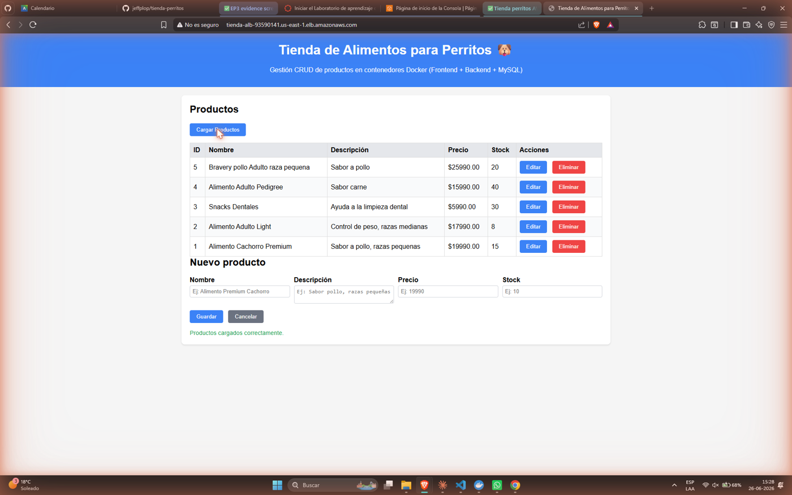
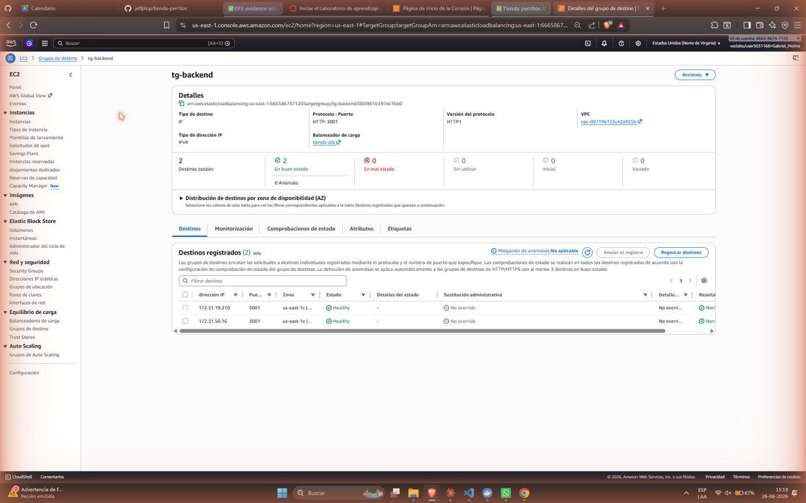
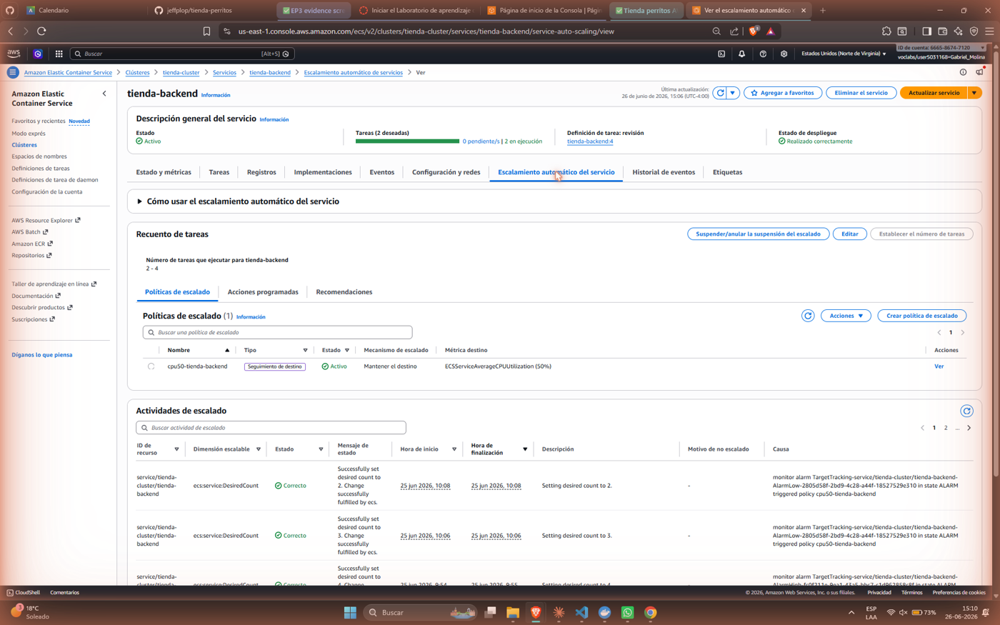
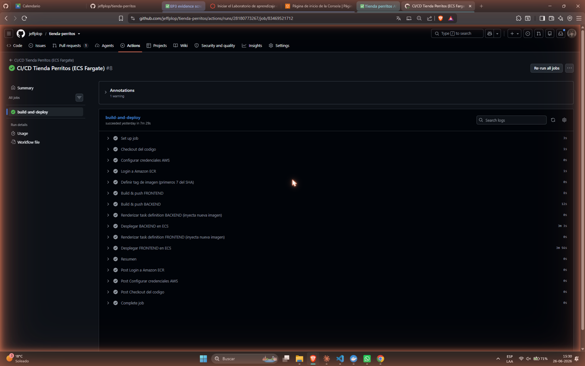
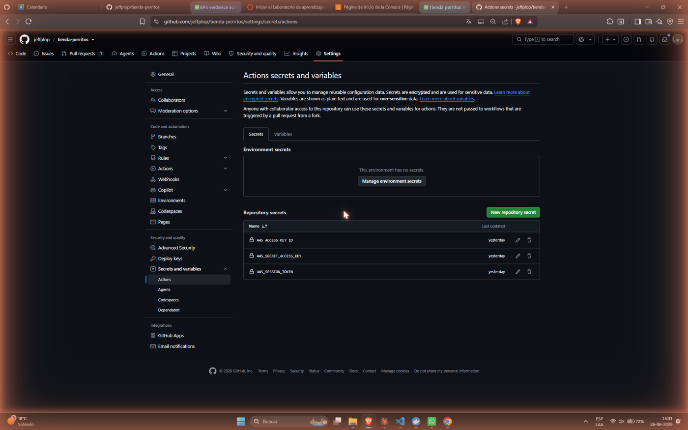
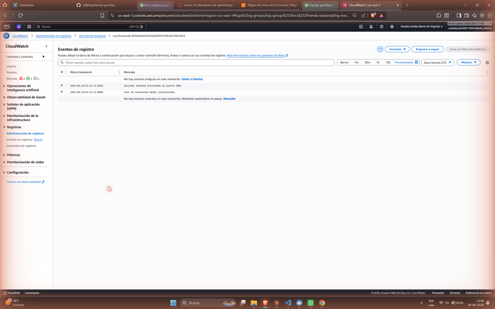

# Informe Técnico — EP3: Orquestación y Automatización en la Nube
## Tienda de Perritos · AWS ECS Fargate + CI/CD con GitHub Actions

**Asignatura:** Introducción a Herramientas DevOps (ISY1101)
**Evaluación:** Parcial N°3 — Encargo con Presentación
**Empresa (caso):** Innovatech Chile
**Integrantes:** [Integrante 1 – Nombre Apellido] · [Integrante 2 – Nombre Apellido]
**Fecha:** Junio 2026
**Repositorio:** https://github.com/jeffplop/tienda-perritos

> **Nota sobre los identificadores:** las capturas de evidencia están embebidas en cada sección
> (consola AWS, GitHub Actions y navegador). Los identificadores que aparecen (ID de cuenta, ARNs,
> DNS de balanceadores, IDs de VPC/Security Group) corresponden a la sesión de **AWS Academy
> Learner Lab del 26-06-2026**. El Learner Lab **regenera estos valores cada vez que se reinicia**,
> por lo que pueden variar entre una sesión y otra.

---

## 1. Introducción y contexto

Innovatech Chile, tras contenedorizar su aplicación (EP2) y montar la infraestructura base en
AWS (EP1), avanza hacia la **orquestación productiva** de su sistema. El objetivo de esta etapa
es ejecutar la aplicación de manera **escalable, tolerante a fallos y automatizable**, y
automatizar por completo los despliegues desde GitHub.

La aplicación de trabajo es **"Tienda de Perritos"**, un CRUD de productos de 3 capas:

- **Frontend**: sitio estático (HTML/JS) servido por **nginx**.
- **Backend**: API REST en **Node.js + Express** con driver **mysql2**.
- **Base de datos**: **MySQL 8** con datos iniciales (`init.sql`).

La solución se desplegó sobre **AWS ECS con Fargate**, con un pipeline **CI/CD en GitHub
Actions** que automatiza el ciclo `build → push (ECR) → deploy (ECS)`.

---

## 2. Arquitectura de la solución

```
                         Internet
                            │
                 ┌──────────▼───────────┐
                 │   ALB público :80    │  tienda-alb-93590141.us-east-1.elb.amazonaws.com
                 │  (Application LB)     │
                 │   /        → frontend │
                 │   /api/*   → backend  │
                 └─────┬──────────┬──────┘
                       │          │
             ┌─────────▼──┐   ┌───▼─────────┐
             │  FRONTEND  │   │   BACKEND   │   (Fargate, red awsvpc)
             │  nginx :80 │   │ node :3001  │   autoscaling CPU 50% (2→4 tasks)
             │  (2 tasks) │   │  (2 tasks)  │
             └────────────┘   └──────┬──────┘
                                     │  DB_HOST = DNS del NLB interno
                              ┌──────▼───────┐
                              │  NLB interno │  (Network LB, TCP 3306)
                              │   :3306      │
                              └──────┬───────┘
                                     │
                              ┌──────▼───────┐
                              │   MySQL DB   │  (1 task, password desde SSM)
                              │  :3306       │
                              └──────────────┘
```

### 2.1 Decisiones arquitectónicas y su justificación

| Decisión | Justificación |
|---|---|
| **ECS Fargate** (no EKS) | En AWS Academy *Learner Lab* no se pueden crear roles IAM nuevos ni usar `eksctl` de forma fiable. Fargate es *serverless* (no hay que administrar nodos EC2) y reutiliza el rol preexistente `LabRole`. Menor superficie de administración y costo controlado. |
| **Comunicación vía balanceadores** (no Cloud Map / Service Connect) | El laboratorio **deniega** la acción `servicediscovery:*`. Por eso el descubrimiento de servicios se resuelve con balanceadores en vez de DNS interno. |
| **ALB público** para Front y Back | Un único punto de entrada HTTP. El **enrutamiento por ruta** (`/` → frontend, `/api/*` → backend) permite que el navegador llame a `/api/*` y el propio ALB lo dirija al backend, **sin** necesidad de DNS interno. |
| **NLB interno** para la base de datos | MySQL es TCP (capa 4), no HTTP. El NLB expone la BD en un **DNS estable** dentro de la VPC que el backend usa como `DB_HOST`. |

### 2.2 Cómo la solución garantiza los atributos de calidad

- **Escalabilidad**: Application Auto Scaling (Target Tracking de CPU) en frontend y backend.
- **Alta disponibilidad**: 2 tasks por servicio repartidas por el balanceador; *health checks* en los *target groups*.
- **Tolerancia a fallos**: si una task muere, ECS la reemplaza para mantener el `desiredCount`; el **circuit breaker de despliegue** hace *rollback* automático si una nueva versión no estabiliza (ver §9).
- **Automatización operativa**: pipeline CI/CD que despliega en cada `push` a `main`.

---

## 3. Configuración del clúster en AWS (IE1)

| Elemento | Valor |
|---|---|
| Región / Cuenta | `us-east-1` / `166658674120` |
| Clúster ECS | `tienda-cluster` (modo Fargate) |
| Modo de red | `awsvpc` (cada task con su propia ENI/IP privada) |
| VPC | `vpc-00719b133c42a925b` |
| Rol de ejecución y de tarea | `arn:aws:iam::166658674120:role/LabRole` (execution + task role) |
| Security Group ALB | `tienda-alb-sg` (`sg-04d81debc111aede1`) — entrante 80 desde Internet |
| Security Group ECS | `tienda-ecs-sg` (`sg-082c82cf2a55dd0be`) — 80/3001 desde el ALB, 3306 dentro de la VPC |

**Roles IAM (aclaración para la defensa):** en el Learner Lab no se permite crear roles, por lo
que se usa el rol gestionado `LabRole` tanto como *execution role* (para que ECS extraiga la
imagen de ECR, lea el secret de SSM y publique logs en CloudWatch) como *task role* (permisos del
contenedor en ejecución). En un entorno productivo real se separarían en roles distintos con
privilegios mínimos.


---

## 4. Despliegue de Frontend y Backend (IE2)

El despliegue se define con **Task Definitions** de Fargate (carpeta `ecs/`). Puntos clave:

- **Imágenes desde Amazon ECR**: `tienda-frontend`, `tienda-backend`, `tienda-db`.
- **Recursos**: frontend y backend `256` CPU / `512` MB; base de datos `512` CPU / `1024` MB.
- **Variables de entorno** (backend): `DB_HOST` (DNS del NLB), `DB_USER=root`,
  `DB_NAME=tienda_perritos`, `DB_PORT=3306`.
- **Secret** (backend y db): `DB_PASSWORD` / `MYSQL_ROOT_PASSWORD` inyectado desde **SSM Parameter
  Store** (`/tienda/db_password`, tipo *SecureString*) — nunca en texto plano.
- **Puertos**: frontend `80`, backend `3001`, base de datos `3306`.
- **Balanceo**: *target groups* `tg-frontend`, `tg-backend` (en el ALB) y `tg-db` (en el NLB).

| Servicio | Tasks (deseadas) | Balanceador | Acceso |
|---|---|---|---|
| `tienda-frontend` | 2 (autoscaling 2→4) | ALB, ruta `/` | Público |
| `tienda-backend` | 2 (autoscaling 2→4) | ALB, ruta `/api/*` | Público vía ALB |
| `tienda-db` | 1 | NLB interno TCP 3306 | Privado (solo VPC) |

**Acceso público al frontend:** `http://tienda-alb-93590141.us-east-1.elb.amazonaws.com`

**Comunicación Front → Back:** el navegador pide `/api/productos`; el ALB, por la regla de
*path-pattern* `/api/*`, enruta esa petición al *target group* del backend. El frontend no
necesita conocer la IP del backend.







---

## 5. Configuración de Autoscaling (IE3)

Se usa **Application Auto Scaling** con política **Target Tracking** sobre la métrica
`ECSServiceAverageCPUUtilization` (archivo `ecs/scaling-cpu.json`):

```json
{
  "TargetValue": 50.0,
  "PredefinedMetricSpecification": {
    "PredefinedMetricType": "ECSServiceAverageCPUUtilization"
  },
  "ScaleInCooldown": 60,
  "ScaleOutCooldown": 60
}
```

| Parámetro | Valor | Justificación |
|---|---|---|
| Métrica | CPU promedio del servicio | Indicador directo de carga de la app. |
| Umbral objetivo | **50%** | Deja **margen** para absorber picos de tráfico antes de saturar, sin sobre-aprovisionar recursos (costo). Es un valor de equilibrio recomendado para cargas web. |
| Mín / Máx tasks | 2 / 4 | Mínimo 2 = alta disponibilidad; máximo 4 = techo de costo en el lab. |
| Cooldowns | 60 s | Evita oscilaciones (escalar y desescalar en cadena) ante variaciones breves. |

**Evidencia:** la consola muestra la **política de escalado** registrada en el servicio y sus
**actividades de escalado** (Figura 8); CloudWatch grafica la métrica de **CPUUtilization** que
dispara el escalado (Figura 9). Bajo carga sostenida, ECS crea tasks adicionales (de 2 hacia 4)
hasta devolver la CPU promedio cerca del objetivo de 50%.




---

## 6. Pipeline CI/CD (IE4)

Workflow: `.github/workflows/deploy-ecs.yml`. Se dispara con cada `push` a `main` y también de
forma manual (`workflow_dispatch`).

**Flujo `build → push → deploy`:**

1. **Checkout** del código.
2. **Configurar credenciales AWS** desde los *secrets* del repositorio.
3. **Login a Amazon ECR**.
4. **Definir tag** de imagen = primeros 7 caracteres del commit SHA.
5. **Build & Push** de las imágenes de frontend y backend a ECR (tags `<sha>` y `latest`).
6. **Render** de la task definition inyectando la nueva imagen
   (`amazon-ecs-render-task-definition`).
7. **Deploy** del servicio en ECS (`amazon-ecs-deploy-task-definition`) con
   `wait-for-service-stability: true` (el pipeline espera a que el servicio quede estable).

El uso de `wait-for-service-stability` es relevante: el pipeline **no termina como exitoso hasta
que ECS confirma** que las nuevas tasks están corriendo y sanas; si no estabilizan, el deploy
falla (ver §8.3).



---

## 7. Gestión de Secrets y credenciales (IE5)

| Mecanismo | Uso |
|---|---|
| **AWS SSM Parameter Store** | Contraseña de la BD (`/tienda/db_password`, *SecureString*). Las task definitions la referencian en el bloque `secrets`; el contenedor la recibe como variable de entorno **en tiempo de ejecución**, no queda en la imagen ni en el repo. |
| **GitHub Actions Secrets** | `AWS_ACCESS_KEY_ID`, `AWS_SECRET_ACCESS_KEY`, `AWS_SESSION_TOKEN` del Learner Lab. El workflow los lee como `${{ secrets.* }}`. |
| **`.gitignore`** | Excluye `.env`, `*.pem`, `aws-credentials*.txt` para no subir credenciales por error. |

**Importante (Learner Lab):** las credenciales incluyen un *session token* que **caduca** al
reiniciar el laboratorio. Antes de ejecutar el pipeline hay que actualizar los 3 *secrets* del
repositorio con las credenciales nuevas (AWS Details → AWS CLI: Show).




---

## 8. Análisis de logs, métricas y tiempos del pipeline (IE6)

### 8.1 Logs (CloudWatch)

Las tres task definitions usan el driver `awslogs`, enviando la salida de cada contenedor a
CloudWatch Logs:

- `/ecs/tienda-frontend`
- `/ecs/tienda-backend`
- `/ecs/tienda-db`

Consulta por CLI: `aws logs tail /ecs/tienda-backend --follow`



### 8.2 Métricas y tiempos del pipeline (datos reales de GitHub Actions)

Se registraron **4 ejecuciones** del workflow durante la integración del pipeline:

| # | Disparador | Commit | Resultado | Duración aprox. |
|---|---|---|---|---|
| 1 | `push` | `20b61ba` | ❌ Falla | ~16 s |
| 2 | `workflow_dispatch` | `20b61ba` | ✅ Éxito | ~10 min |
| 3 | `push` | `93eca2e` | ❌ Falla | ~15 min |
| 4 | `push` | `9f862bb` | ✅ Éxito | ~16 min |

**Observaciones:**

- El *build & push* de imágenes + *deploy* con espera de estabilización toma **~10–16 minutos**.
  La mayor parte del tiempo se va en `wait-for-service-stability` (ECS levanta las tasks nuevas,
  pasa health checks y drena las antiguas).
- La diferencia entre run #2 (~10 min) y run #4 (~16 min) se explica porque el run #4 desplegó
  **dos servicios** (backend y frontend) y coincidió con otra ejecución en curso.

### 8.3 Análisis de fallas (causa raíz, extraída de los logs)

**Falla run #1 — `Could not load credentials from any providers`:**
La primera ejecución por `push` falló en **16 segundos** en el paso *Configurar credenciales AWS*,
porque los *secrets* (`AWS_ACCESS_KEY_ID`, etc.) **aún no estaban cargados** en el repositorio.
*Solución:* cargar los 3 secrets del Learner Lab en Settings → Secrets → Actions y reejecutar.

**Falla run #3 — `Deployment ... rolled back by the deployment circuit breaker`:**
Con las credenciales ya configuradas, el deploy del backend arrancó pero **no estabilizó**, y el
**circuit breaker de despliegue de ECS hizo *rollback* automático** a la versión anterior. Causa
probable: las tasks nuevas no superaron el *health check* a tiempo (o la ejecución coincidió con
otro deploy simultáneo sobre el mismo servicio). *Solución:* relanzar el pipeline una vez liberado
el servicio (run #4 quedó **estable y en verde**, ver Figura 10).

### 8.4 Conclusiones del análisis

1. El pipeline es **funcional y reproducible**: tras configurar correctamente los secrets, las
   ejecuciones #2 y #4 completaron `build → push → deploy` con éxito.
2. Las fallas observadas **no fueron del código**, sino de **configuración** (secrets ausentes) y
   de **estabilización del despliegue** (circuit breaker) — ambas diagnosticables desde los logs.
3. El **circuit breaker** aportó tolerancia a fallos: ante un deploy defectuoso, el sistema volvió
   solo a la versión estable, sin intervención manual.

---

## 9. Validación funcional del clúster (IE7)

**Endpoints del backend:**

| Método | Ruta | Función |
|---|---|---|
| GET | `/api/health` | Healthcheck (`{status: "ok"}`) |
| GET | `/api/productos` | Listar productos |
| POST | `/api/productos` | Crear producto |
| PUT | `/api/productos/:id` | Actualizar producto |
| DELETE | `/api/productos/:id` | Eliminar producto |

**Validación realizada:**

1. La página carga desde la URL del ALB → **frontend operativo** (Figura 4).
2. *Cargar Productos* lista los registros → **Front → Back → BD operativo** (Figura 4).
3. Operaciones **CRUD** (crear / editar / eliminar) reflejadas en la tabla y persistidas en MySQL.
4. Los **eventos del servicio** muestran el despliegue alcanzando *steady state* y el registro de
   destinos en el balanceador (Figura 14).
5. **Autorecuperación**: si una task muere, ECS levanta otra para mantener el `desiredCount`
   (mismo mecanismo que repone el servicio tras un redeploy).


---

## 10. Problemas encontrados y soluciones (resumen para la defensa)

| Problema | Causa | Solución aplicada |
|---|---|---|
| `servicediscovery ... AccessDenied` | Cloud Map / Service Connect denegado en el Learner Lab | Comunicación con **ALB** (front→back, por ruta) y **NLB** (back→db, TCP) en vez de DNS interno |
| No se pueden crear roles IAM / usar `eksctl` | Restricciones del Learner Lab | Uso de **ECS Fargate** con el rol preexistente **`LabRole`** |
| Pipeline run #1: `Could not load credentials` | Secrets de AWS no cargados aún | Cargar los 3 secrets del lab en el repo |
| Pipeline run #3: rollback por circuit breaker | Tasks nuevas no estabilizaron | Relanzar el deploy (run #4 estable) |
| `docker login ... 400 Bad Request` | PowerShell corrompe el token por *stdin* | Usar `docker login -u AWS -p <token>` |
| `ExpiredToken` / créditos del lab agotados | Sesión del Learner Lab caducó o sin presupuesto | Pegar credenciales nuevas; continuar en otra cuenta de Learner Lab disponible |

---

## 11. Conclusiones y proyección productiva

La solución cumple el objetivo de la EP3: la aplicación de Innovatech Chile queda **orquestada en
ECS Fargate**, es **escalable** (autoscaling de CPU), **tolerante a fallos** (reemplazo de tasks +
circuit breaker) y con **despliegue automatizado** (CI/CD en GitHub Actions).

**Proyección hacia un entorno productivo real:**

- Reemplazar el `LabRole` único por **roles IAM separados** con privilegio mínimo.
- Migrar la BD a **Amazon RDS** (gestionada, con backups y multi-AZ) en lugar de un contenedor MySQL.
- Habilitar **HTTPS** en el ALB (certificado ACM) y un dominio propio (Route 53).
- Usar **OIDC** entre GitHub y AWS en vez de claves estáticas que caducan.
- Añadir **alarmas de CloudWatch** y un entorno de *staging* previo a producción.

---

## Anexo A — Checklist de evidencias (estado)

- [x] Consola ECS: clúster `tienda-cluster` con los 3 servicios activos (Figura 1).
- [x] Security Groups: reglas inbound de `tienda-alb-sg` y `tienda-ecs-sg` (Figuras 2 y 3).
- [x] *Target group* del backend con destinos registrados (Figura 6).
- [x] App en el navegador (URL del ALB) con la tabla de productos cargada (Figura 4).
- [x] Operación CRUD sobre productos (Figura 4 / demostrada en el video del proceso).
- [x] CloudWatch Logs del backend (Figura 13).
- [x] Política de autoscaling + métrica de CPU (Figuras 8 y 9).
- [x] Eventos del servicio (*steady state* / registro de destinos) (Figura 14).
- [x] Repositorios en Amazon ECR (Figura 7).
- [x] Secrets: SSM Parameter Store (Figura 11) y GitHub Actions Secrets (Figura 12).
- [x] Pipeline de GitHub Actions en verde (Figura 10).

---

## Anexo B — Glosario rápido (para la defensa)

- **ECS**: servicio de orquestación de contenedores de AWS.
- **Fargate**: motor *serverless* de ECS; AWS administra los servidores subyacentes.
- **Task Definition**: "plantilla" que describe un contenedor (imagen, CPU/mem, puertos, variables, secrets, logs).
- **Servicio ECS**: mantiene N tasks corriendo (`desiredCount`) y las integra con el balanceador.
- **ALB / NLB**: balanceadores de capa 7 (HTTP, enruta por ruta) y capa 4 (TCP), respectivamente.
- **Target Group**: conjunto de destinos (tasks) que un balanceador chequea y al que envía tráfico.
- **Target Tracking**: política de autoscaling que ajusta el N° de tasks para mantener una métrica en un objetivo (CPU 50%).
- **Circuit breaker**: mecanismo de ECS que revierte un despliegue si las tasks nuevas no estabilizan.
- **ECR**: registro privado de imágenes Docker de AWS.
- **SSM Parameter Store**: almacén de parámetros/secrets gestionado.
